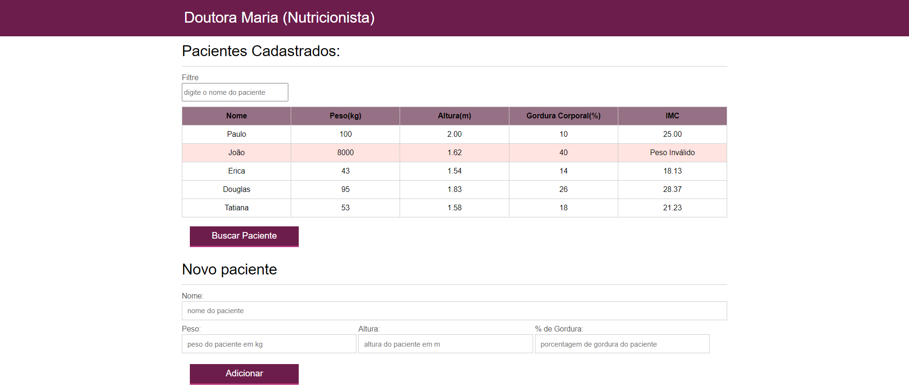

## Nutricionista 👩‍⚕️
#
#### Projeto de um sistema de cálculo de IMC e visualização de pacientes usando CSS, HTML e JavaScript, com busca e importação de arquivo JSON. Feito durante o curso de **JavaScript: Programando na linguagem da web**, da Alura 💜 

#### Nesse projeto foi possível aprofundar os conceitos básicos de javascript, como variáveis, operadores, loops, arrays e muito mais. 
#### O resultado foi o seguinte:

